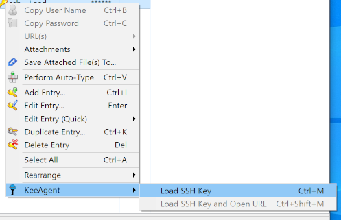

==========
Menu Items
==========

KeeAgent adds several menu items to KeePass.

Main / Application Menu
=======================

This is the KeePass application menu.

.. figure:: images/win10-keepass-application-menu.png
    :alt: KeePass - Application Menu

Tools Menu
----------

KeeAgent adds one item to the Tools menu.

.. figure:: images/win10-keepass-tools-menu.png
    :alt: KeePass - Tools menu - KeeAgent

KeeAgent
    Opens the KeeAgent Manager dialog.

.. todo:: Add link to page on KeeAgent manager.

Help Menu
---------

KeeAgent adds one item to the Help menu.

.. figure:: images/win10-keepass-help-menu.png
    :alt: KeePass - Help menu - KeeAgent

KeeAgent
    Opens the KeeAgent documentation in a web browser.

Entry Context Menu
==================

The Entry Context Menu is accessed by right-clicking on an entry in the entry list.

Load SSH Key
    Loads key from the selected entry in to the agent.
    
    .. note:: This menu item is only visible if the selected entry has the "Allow
        KeeAgent to use this entry" option checked.
        
    .. warning:: If the key is already loaded in the agent, it will be replaced.
        This could potentially change any constraints the key has.

URL(s) > Load SSH Key and Open URL
    Loads key from the selected entry in to the agent and then opens the URL
    for the entry.
    
    This item is basically a shortcut for the combination of the *Load SSH Key*
    and *URL(s) > Open* menu items.

Notification Tray Icon Menu
===========================

.. figure:: images/win10-keepass-notification-tray-menu.png
        :alt: KeePass - Tray Icon Menu - KeeAgent

KeeAgent
    Opens the KeeAgent Manager dialog. (Same as *Tools > KeeAgent* in the application menu.)

.. tip:: If you are missing this icon on your Linux desktop, check out `this
        plugin`__.

        .. __: https://github.com/dlech/Keebuntu
