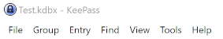
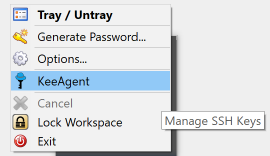

==========
Menu Items
==========

KeeAgent adds several menu items to KeePass.

Main / Application Menu
=======================

This is the KeePass application menu.

Group Menu
----------

The *Group Menu* is accessed by clicking on *Group* in the main application menu
or by right-clicking on an group in the group navigation pane on the left side
of the main window in KeePass.

**Load SSH Keys** (Ctrl+M)
    Loads keys from the selected group in to the agent.

    .. note:: This menu item is only visible if the selected group contains any
        SSH keys.

Entry Menu
----------

The *Entry Menu* is accessed by clicking *Entry* in the main application menu
or by right-clicking on an entry in the entry list.

.. figure:: images/win10-keepass-context-menu-expanded.png
        :alt: Screenshot of KeePass main window entry context menu on Windows 10

**Load SSH Key** (Ctrl+M)
    Loads key from the selected entry in to the agent.

    .. note:: This menu item is only visible if the selected entry has the *Allow
        KeeAgent to use this entry* option checked.

    .. warning:: If the key is already loaded in the agent, it will be replaced.
        This could potentially change any constraints the key has.

**URL(s) > Load SSH Key and Open URL** (Ctrl+Shift+M)
    Loads key from the selected entry in to the agent and then opens the URL
    for the entry.

    This item is basically a shortcut for the combination of the *Load SSH Key*
    and *URL(s) > Open* menu items.

Tools Menu
----------

KeeAgent adds one item to the Tools menu.

KeeAgent
    Opens the KeeAgent Manager dialog.

.. todo:: Add link to page on KeeAgent manager.

Help Menu
---------

KeeAgent adds one item to the Help menu.

KeeAgent
    Opens the KeeAgent documentation in a web browser.

Notification Tray Icon Menu
===========================

KeeAgent
    Opens the KeeAgent Manager dialog. (Same as *Tools > KeeAgent* in the application menu.)

.. tip:: If you are missing this icon on your Linux desktop, check out `this
        plugin`__.

        .. __: https://github.com/dlech/Keebuntu
