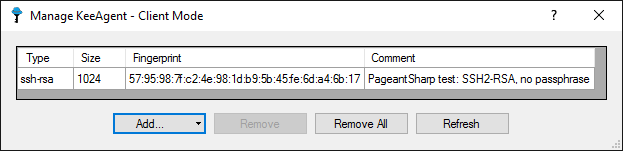

================
KeeAgent Manager
================

The KeeAgent Manager lists the keys that are currently loaded into the agent.
From here, you can lock and unlock the agent as well as add and remove keys.
The KeeAgent manager is opened from Tools > KeeAgent or from the notification
tray icon menu.

**Mode Indication**

    The "mode" being used by KeeAgent is displayed in the title bar of the
    KeeAgent manager. *Agent Mode* indicates that KeeAgent is acting as the SSH
    agent. *Client Mode* indicates that KeeAgent is using an external SSH agent.
    See Global Options for more information.

**List Columns**

    -   **C** (Confirm Constraint - Agent mode only): Checked indicates that the
        user must confirm the use of the key every time a client requests to use
        the key for authentication.

    -   **L** (Lifetime Constraint - Agent mode only): Checked indicates that the
        key will be automatically removed after a period of time.

    -   **Type**: The encryption algorithm used by the key.

    -   **Size**: The size (in bits) of the key.

    -   **Fingerprint**: The MD5 hash of the key.

    -   **Comment**: The comment associated with the key.

    -   **Source**: (Agent mode only): The source of the key. This can be one of
        the following: the name of a database and the path of the entry in the
        database, the name of a file or "External client" if the key was loaded
        through a utility such as ``ssh-add``.

**Lock and Unlock Buttons**

    Clicking *Lock* will prompt you for a passphrase. The passphrase can be
    anything - it is temporary. After entering a passphrase, the agent will be
    locked. This means that no keys can be added or removed or used for
    authentication until the agent is unlocked. To unlock, click *Unlock* and
    enter the same passphrase that you used when you locked the agent.

    .. note:: Locking and unlocking the agent is completely independent of
        locking and unlocking databases in KeePass.

    .. note:: Pageant does not support locking/unlocking, so if you are in
        *Client Mode* and connecting to Pageant, these buttons will not be shown.

**Add.. Button**

    -   **From KeePass...**: Shows a dialog that allows you to load a key from
        an entry in any of the databases currently open in KeePass. Select an
        entry and optionally select constrains, then click *OK* to load the key
        into the agent.

        .. note:: If you are in Client Mode and using Pageant, the checkboxes
            for constraints will not be shown. Pageant does not support constraints.

        .. figure:: images/win10-keepass-keeagent-manager-select-entry-dialog.png
            :alt: Screenshot of the KeeAgent Manager Select Entry dialog box

    -   **From File...**: Shows a file browser dialog that allows you to load a
        key from an external file. You can also selectively add constraints to
        the keys.

        .. note:: Constraint checkboxes are integrated into the file dialog on
            Windows only. If you are on another OS, hold down the Control key
            when you click OK and you will get a separate dialog to enter
            constraints.

        .. note:: If you are in Client Mode and using Pageant, the checkboxes
            for constraints will not be shown. Pageant does not support constraints.

        .. figure:: images/win10-keepass-keeagent-manager-file-browser.png
            :alt: Screenshot of KeeAgent Manager file browser dialog box

**Remove Button**

    Removes the selected key(s) from the agent.

**Remove All Button**
    
    Removes all keys from the agent.

**Refresh Button** (Client mode only)

    Sends a request to the agent for a current list of keys.
