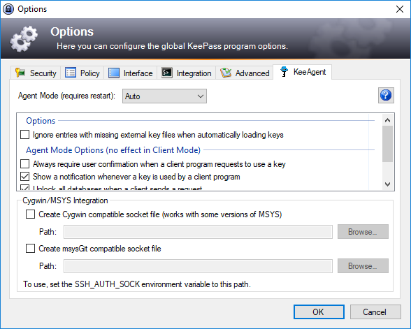
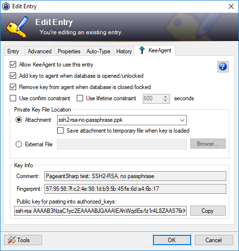

====================
Options and Settings
====================

KeeAgent has options that apply globally and options that apply to individual
password entries. The global options are saved in the KeePass configuration file,
so they only affect a single installation. The password entry options are saved
in the database file.

.. _global-options:

Global Options
==============

Global Options are accessed via *Tools > Options...*, then click on the *KeeAgent*
tab.

**Agent Mode**

    -   **Auto**: (default) Detects if another ssh agent (i.e. Pageant on windows
        or ssh-agent on Linux) is running. If another agent is running, then it
        starts in Client mode, otherwise it will start in Agent mode.

        .. tip:: You can find out which mode was selected by opening the KeeAgent
            Manager and looking at the title bar. It will say either *Client Mode*
            or *Agent Mode*.

    -   **Agent**: KeeAgent will act as an SSH agent. If another SSH agent is
        already running, KeeAgent will not load.

    -   **Client**: KeeAgent will act as an SSH agent client. For example, you
        can use this mode to load keys stored in KeePass into Pageant. If there
        is not SSH agent running, you will get an error when you try to load keys.

**Options**

    Common options that affect both *Agent* mode and *Client* mode.

    -   **Ignore entries with missing external key files when automatically
        loading keys**: (default: disabled) Do not show an error message when
        external key files linked to password entries are missing. This option
        is useful when you use the same KeePass database on multiple computers.

**Agent Mode Options** (no effect in *Client* mode)

    These options only affect KeeAgent when running in *Agent* mode.

    -   **Always require confirmation when client program requests to use key**:
        (default: disabled) Prompts the user for permission every time a client
        application requests a key regardless of any other settings.

        .. note:: When checked, this overrides the per-entry *Use confirm
            constraint* setting. Keys must be unloaded and re-loaded for this
            setting to take effect.

    -   **Show notification whenever key is used by a client program**: (default:
        enabled) Shows notification in the taskbar when a client application
        requests a key. Notifications only work in Windows.

    -   **Unlock all databases when a client sends a request**: (default: enabled)
        When a client program sends a request, KeePass will display the unlock
        dialog before the client request is answered.

    -   **Show selection dialog when a client program requests a list of keys**:
        (default: disabled) When this option is disabled, KeeAgent will send a
        list of all keys to the client program when requested. When enabled,
        this option will show a key selection dialog each time a client program
        requests a list of keys.

        .. tip:: Many SSH servers will refuse to connect if there are more than
            6 keys loaded. This option can be used to work around that limitation.

    -   **Enable agent for Windows OpenSSH**: (default: disabled)
        Enable an SSH agent socket compatible with the built-in Windows 10 SSH
        client.

**Cygwin/MSYS/WSL Integration** (Windows only, no effect in *Client* mode)

    -   **Create Cygwin compatible socket file (may work with some versions of
        MSYS)**: (default: disabled) Creates a file that can be used by Cygwin
        programs to access KeeAgent.

        -   **Path**: The path of the file in the option above.

        -   **Browse...**: Opens a file browser to select the path above.

    -   **Create msysGit compatible socket file**: (default: disabled) Creates a
        file that can be used by MSYS programs to access KeeAgent.

        -   **Path**: The path of the file in the option above.

        -   **Browse...**: Opens a file browser to select the path above.

    -   **Create WSL1 compatible socket file**: (default: disabled) Creates a
        file that can be used by Windows Susbsystem for Linux V1 programs to access KeeAgent.

        -   **Path**: The path of the file in the option above.

        -   **Browse...**: Opens a file browser to select the path above.

    Also see the :doc:`tips-and-tricks` page for more info.

    .. tip:: In order to use the socket file with ssh in Cygwin/MSYS/WSL1, you need to
        set the ``SSH_AUTH_SOCK`` environment variable to the same path::

            export SSH_AUTH_SOCK="C:\path\to\socket\file"

        For WSL1, the path will look like::

            export SSH_AUTH_SOCK="/mnt/c/path/to/socket/file"

        You can make this permanent/automatic either by setting this environment
        variable in the *Advanced* tab of *System Properties* or in your ``.bashrc``
        in Cygwin/MSYS/WSL.

    .. tip:: If KeePass crashes, you will need to manually delete the socket
        file before restarting KeePass or you will get an error that the file
        already exists.

    .. tip:: If you try to run two instance of KeePass at once with the same
        file path options, you will also get an error that the file already
        exists.

    .. danger:: In addition to creating a file, KeeAgent also listens on the
        loopback network interface (127.0.0.1) for connections when either of
        the Cygwin or MSYS options are enabled. The network sockets have no authentication
        mechanism. This is a limitation of the implementation in Cygwin/MSYS.
        This means that other users of the same computer can use any keys
        loaded in KeeAgent. Therefore, it is not recommended to use this
        feature on a shared computer.

Entry Settings
==============

Entry Settings are accessed by double-clicking the Title of an entry or by
selecting an entry and then either pressing Return or clicking *Edit > Edit/View
Entry* or by right-clicking an entry and selecting *Edit/View Entry*.

-   **Allow KeeAgent to use this entry**: (default: disabled) When disabled,
    the entry will be hidden from KeeAgent, even if it has an SSH key
    associated with it. When enabled, the entry will be available for use
    by KeeAgent.

-   **Add key to agent when database is opened/unlocked**: (default: enabled)
    When enabled, the key associated with this entry will be automatically
    loaded into the agent when the database containing this entry is opened
    or unlocked, otherwise the key will not be automatically added. It can
    still be manually added.

-   **Remove key from agent when database is closed/locked**: (default:
    enabled) When enabled, the key associated with this entry will be
    automatically removed from the agent when the database containing this
    entry is closed or locked, otherwise the key will not be automatically
    removed.

-   **Use confirm constraint**: (default: disabled) When enabled, you will
    be prompted to confirm the use of a key each time it is requested to be
    used by a client program. This option is not available if the global
    Always require confirmation when client program requests to use key
    option is enabled. This option will not have an effect in client mode
    if the SSH agent does not support confirm constraints.

-   **Use lifetime constraint**: (default: disabled) When enabled, they key
    will only remain loaded for the amount of time specified. This option
    will not have an effect in client mode if the SSH agent does not support
    confirm constraints.

-   **Private Key File Location**: Specifies where to find the key file.

    -   **Attachment**: Use a key that is saved as an attachment in this entry.
        Choose the attachment from the list.

    -   **Save attachment to temporary file when key is loaded**: (default:
        disabled) When enabled, KeeAgent will save the attachment to a
        temporary file when the key is loaded and delete the file when the
        key is unloaded (if KeePass crashes, the file will not be deleted).
        The name of the temporary file can be retrieved using the
        ``{KEEAGENT:KEYFILEPATH}`` placeholder in KeePass.

        If you are not able to use the placeholder (e.g. you are using an
        external script, the path is determined as follows...

        On Windows, the base directory will be the first path found from the
        following:

        -   The path specified by the ``TMP`` environment variable.
        -   The path specified by the ``TEMP`` environment variable.
        -   The path specified by the ``USERPROFILE`` environment variable.
        -   The Windows directory.

        ...followed by a ``KeeAgent`` directory, then the file name. Example::

            %USERPROFILE%\AppData\Local\Temp\KeeAgent\my-key.ppk

        On Linux, the base directory will be the first path found from the
        following:

        -   The path specified by the ``XDG_RUNTIME_DIR`` environment variable.
        -   The path ``~/.local/share``

        ...followed by a ``KeePass/KeeAgent`` directory, then the file name.
        Example::
        
            $XDG_RUNTIME_DIR/KeePass/KeeAgent/is_rsa

    -   **External File**: Use an external key file. Click browse to select the
        file or type in the path to the file.

        .. tip:: For portable installations, you can use relative path names.
            The working directory depends on your KeePass installation and
            settings. It is generally your home directory (e.g. ``C:\Users\myname``
            or ``/home/myname``) or the ``KeePass.exe`` directory if using the
            portable version of KeePass.

    -   **Key Info**: Read-only information about the SSH key.

        -   **Comment**: The comment stored in the key file (not all key file
            types are capable of storing comments).

        -   **Fingerprint**: The MD5 hash of the public key.

        -   **Public key for pasting into authorized_keys**: The public key in
            the proper format for pasting into the authorized_keys file (usually
            ``~/$USER/.ssh/authorized_keys``) on your server.

        -   **Copy**: Copies the public key in the authorized_keys format to the
            clipboard.
