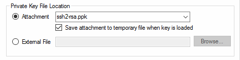

===============
Tips and Tricks
===============

Creating URL Overrides to Open a Connection
===========================================

Having lots of SSH keys loaded in KeeAgent can be a problem for many servers.
To work around this, many ssh programs allow you to specify an identity file when
connecting so that it knows which key to use instead of having to try all the
keys that are loaded.

Since SSH keys in KeeAgent are usually saved as attachments embedded in the
database, there is an option in the *Entry Settings* to save the key to an actual
file on disk when the key is loaded in KeeAgent.

        temporary file when key is loaded" checked
    
Once you have selected this option, there will be two placeholders available for
use in KeePass.

-   ``{KEEAGENT:KEYFILEPATH}`` returns the full path. e.g. ``C:\path\to\keyfile.ppk``
-   ``{KEEAGENT:IDENTFILEOPT}`` returns the identity file command line option
    that is used by both PuTTY.exe and ssh. e.g. ``-i "C:\path\to\keyfile.ppk"``

You can use these placeholders to create URL overrides. Global overrides are at
*Tools > Options > Integration (tab) > URL Scheme Overrides...* or they can be
specified per-entry on the *Properties* tab of *Entry Settings*.

.. note:: The placeholders also work with the *External File* location in
    addition to attachments.

Example:

    Open an ssh connection using PuTTY with the username and host specified in
    the database entry. The entry must have the Username and URL fields filled
    out for this to work.
    ::

        cmd://"C:\Program Files (x86)\PuTTY\PuTTY.exe" -ssh {USERNAME}@{URL:RMVSCM} {KEEAGENT:IDENTFILEOPT}

.. tip:: Read more about the PuTTY command line `here`__. For example, the
    ``-load`` option is useful to load a saved session associated with the key.

.. __: http://the.earth.li/~sgtatham/putty/latest/htmldoc/Chapter3.html#using-cmdline

Using KeeAgent on Windows
=========================

Client mode with Pageant
------------------------

KeeAgent (in Agent Mode) is designed to work much like ``ssh-agent`` on Linux/BSD/etc...
Pageant is very similar, but there are some notable differences. Because of the
more limited features of Pageant, it is recommended to run in Agent mode on
Windows instead of using Pageant. However, if you have a good reason to run
KeeAgent in Client Mode along with Pageant, here are some things to be aware of:

-   Pageant does not support locking.
-   Pageant does not support constraints.
-   Pageant does not support ECDSA or Ed25519 keys (except in the development version).

Cygwin and MSYS
---------------

KeeAgent can natively communicate with ssh programs running in Cygwin and
MSYS. It is enabled in the :ref:`global-options` dialog.

There are two implementations of sockets that are found in the various versions
of Cygwin and MSYS. MSYS is really just a fork of Cygwin, so it depends on which
fork the code is based on. So, unless you are using msysGit, try the "Cygwin
socket file" first and if that does not work, try the "msysGit socket file".
In some cases, you may need both enabled to support multiple versions of
Cygwin/MSYS.
